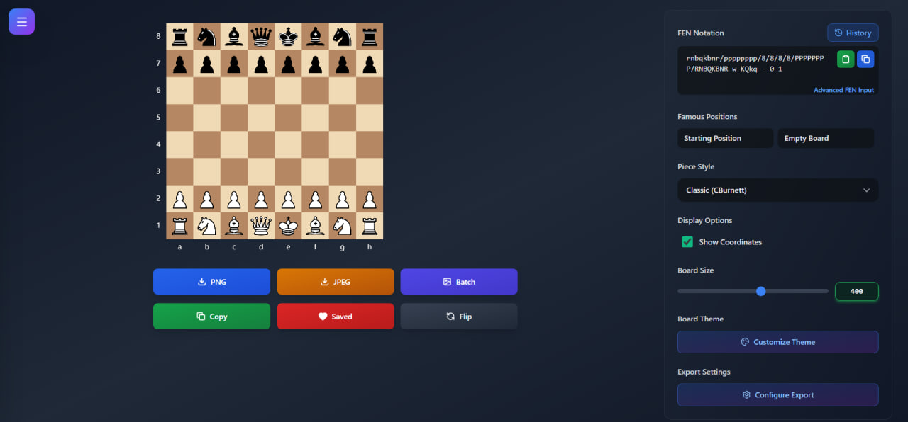

<h1 align='center'> ♟️ Chess Diagram Generator</h1>

<div align="center">

**Professional chess position visualizer with ultra-HD export capabilities**

[](https://reactjs.org/)
[](https://tailwindcss.com/)
[](https://opensource.org/licenses/MIT)
[](http://makeapullrequest.com)

[Live Demo](https://chess-diagram-generator.vercel.app) · [Report Bug](https://github.com/BilgeGates/chess_viewer/issues) · [Request Feature](https://github.com/BilgeGates/chess_viewer/issues)

</div>

---

## 📖 Table of Contents

- [Overview](#-overview)
- [Features](#-features)
- [Demo & Screenshots](#-demo--screenshots)
- [Quick Start](#-quick-start)
- [Project Structure](#-project-structure)
- [Technology Stack](#-technology-stack)
- [Browser Support](#-browser-support)
- [Contributing](#-contributing)
- [License](#-license)

---

## 🌟 Overview

Chess Diagram Generator is a cutting-edge web application designed for chess enthusiasts, coaches, authors, and content creators. Built with modern React and optimized for performance, it offers professional-grade chess diagram generation with unprecedented customization options. 

### Why Choose Chess Diagram Generator?

- 🎯 **Straightforward UX** – Clean interface focused on productivity
- 🚀 **High-performance rendering** – Optimized Canvas-based board drawing
- 🎨 **Extensive customization** – Multiple piece sets, themes, and export controls
- 📱 **Responsive by design** – Works on desktop and tablet browsers
- 🔒 **Privacy-focused** – No backend, no tracking, fully client-side
- 🖼️ **High-resolution exports** – Suitable for articles, books, and presentations

---

## ✨ Features

### 🖼️ Ultra-HD Export System
<table>
<tr>
<td width="50%">

**Export Capabilities**
- 8x to 32x quality multipliers
- PNG (lossless) & JPEG (optimized)
- Batch export multiple formats
- One-click clipboard copy
- Real-time preview updates

</td>
<td width="50%">

**Resolution Options**
- **8x**: 3,200×3,200px (~1MB)
- **16x**: 6,400×6,400px (~3MB) ⭐
- **24x**: 9,600×9,600px (~5MB)
- **32x**: 12,800×12,800px (~6MB+)

</td>
</tr>
</table>

### ♟️ Advanced Chess Features

```plaintext
### Key Features
- Full FEN notation support with real-time validation
- Advanced FEN input (up to 10 positions with pagination)
- 27+ professional chess piece sets
- Custom board themes and color presets
- Coordinate system (a–h, 1–8)
- Board flip (White / Black perspective)
- Position history and favorites
- Famous chess positions library
- Batch processing and multi-export support
```

## 🖼️ Demo & Screenshots

> Live demo: https://chess-diagram-generator.vercel.app




### 🎨 Customization Engine

<details>
<summary><b>Color System (Click to expand)</b></summary>

- **12 Preset Themes**: Brown, Blue, Green, Wood, Purple, Red, Gray, Marble, Pink, Turquoise, Custom Light, Custom Dark
- **Advanced Color Picker**:
  - HSL/RGB/HEX input modes
  - 8 curated color palettes (Basic, Grays, Warm, Cool, Nature, Sunset, Ocean, Royal)
  - HSV canvas picker with 360° hue slider
  - Live contrast ratio calculation
  - Random color generation

</details>

<details>
<summary><b>Board Customization (Click to expand)</b></summary>

- **Size Control**: 150px - 600px with live preview
- **Coordinates**: Toggle file (a-h) and rank (1-8) labels
- **Orientation**: View from White or Black perspective
- **Piece Sets**: CBurnett, Merida, Alpha, Cardinal, Chess7, Companion, Dubrovny, Fantasy, Fresca, Gioco, Governor, Horsey, ICPieces, Kosal, Leipzig, Letter, Libra, Maestro, Pirouetti, Pixel, ReillyCraig, Riohacha, Shapes, Spatial, Staunty, Tatiana

</details>

---

## 🚀 Quick Start

### Prerequisites

```bash
Node.js >= 16.x
npm >= 8.x (or yarn >= 1.22.x)
```

### Installation

```bash
# Clone the repository
git clone https://github.com/BilgeGates/chess_viewer.git

# Navigate to project directory
cd chess_viewer

# Install dependencies
npm install
# or
yarn install

# Start development server
npm start
# or
yarn start
```

The application will automatically open at [http://localhost:3000](http://localhost:3000)

### Production Build

```bash
# Create optimized production build
npm run build

# Preview production build locally
npm run preview

# Deploy to Vercel (requires Vercel CLI)
vercel --prod
```
---

## 📁 Project Structure

<details>
<summary><b>Complete File Tree (Click to expand)</b></summary>

```
chess_viewer/
│
├── 📂 public/
│   ├── index.html
│
├── 📂 src/
│   │
│   ├── 📂 components/
│   │   │
│   │   ├── 📂 board/              # Chess Board Rendering
│   │   │   ├── BoardSquare.jsx    # Single square component (memoized)
│   │   │   ├── BoardGrid.jsx      # 8×8 grid layout
│   │   │   ├── ChessBoard.jsx     # Main board with Canvas rendering
│   │   │   ├── MiniChessPreview.jsx # Thumbnail for history
│   │   │   └── index.js
│   │   │
│   │   ├── 📂 controls/           # Control Panel System
│   │   │   │
│   │   │   ├── 📂 atoms/          # Atomic components
│   │   │   │   ├── FENInputField.jsx
│   │   │   │   ├── FamousPositionButton.jsx
│   │   │   │   └── index.js
│   │   │   │
│   │   │   ├── 📂 modals/         # Modal dialogs
│   │   │   │   ├── AdvancedFENInputModal.jsx
│   │   │   │   ├── ExportSettingsModal.jsx
│   │   │   │   ├── FENHistoryModal.jsx
│   │   │   │   ├── ThemeModal.jsx
│   │   │   │   └── index.js
│   │   │   │
│   │   │   ├── ControlPanel.jsx   # Main control container
│   │   │   ├── BoardSizeControl.jsx
│   │   │   ├── DisplayOptions.jsx
│   │   │   ├── ExportSettings.jsx
│   │   │   ├── FENInput.jsx
│   │   │   ├── PieceSelector.jsx
│   │   │   ├── ThemeSelector.jsx
│   │   │   └── index.js
│   │   │
│   │   ├── 📂 ui/                 # Reusable UI Components
│   │   │   │
│   │   │   ├── 📂 base/           # Base components
│   │   │   │   ├── Badge.jsx
│   │   │   │   ├── Button.jsx
│   │   │   │   ├── Card.jsx
│   │   │   │   ├── Checkbox.jsx
│   │   │   │   ├── Input.jsx
│   │   │   │   ├── Modal.jsx
│   │   │   │   ├── Select.jsx
│   │   │   │   ├── SearchableSelect.jsx
│   │   │   │   ├── RangeSlider.jsx
│   │   │   │   └── index.js
│   │   │   │
│   │   │   ├── 📂 color-picker/   # Advanced color picker
│   │   │   │   │
│   │   │   │   ├── 📂 parts/      # Picker components
│   │   │   │   │   ├── ColorCanvas.jsx
│   │   │   │   │   ├── ColorInput.jsx
│   │   │   │   │   ├── ColorPalettes.jsx
│   │   │   │   │   ├── ColorSwatch.jsx
│   │   │   │   │   ├── HueSlider.jsx
│   │   │   │   │   ├── PrimaryActions.jsx
│   │   │   │   │   ├── SelectedPreview.jsx
│   │   │   │   │   ├── ThemePresetCard.jsx
│   │   │   │   │   └── index.js
│   │   │   │   │
│   │   │   │   ├── 📂 views/      # Picker views
│   │   │   │   │   ├── ThemeMainView.jsx
│   │   │   │   │   ├── ThemeAdvancedPickerView.jsx
│   │   │   │   │   ├── ThemeSettingsView.jsx
│   │   │   │   │   └── index.js
│   │   │   │   │
│   │   │   │   ├── ColorPicker.jsx
│   │   │   │   ├── PickerModal.jsx
│   │   │   │   └── index.js
│   │   │   │
│   │   │   ├── ActionButtons.jsx
│   │   │   ├── ExportProgress.jsx
│   │   │   ├── NotificationContainer.jsx
│   │   │   ├── UserGuide.jsx
│   │   │   └── index.js
│   │   │
│   │   └── 📂 layout/             # Layout components
│   │       ├── Navbar.jsx
│   │       ├── Footer.jsx
│   │       └── index.js
│   │
│   ├── 📂 pages/                  # Application pages
│   │   ├── HomePage.jsx
│   │   ├── AboutPage.jsx
│   │   ├── DownloadPage.jsx
│   │   ├── SupportPage.jsx
│   │   └── index.js
│   │
│   ├── 📂 hooks/                  # Custom React hooks
│   │   ├── useChessBoard.js       # FEN parsing & validation
│   │   ├── usePieceImages.js      # Image loading & caching
│   │   ├── useFENHistory.js       # History management
│   │   ├── useTheme.js            # Theme state
│   │   ├── useNotifications.js    # Toast system
│   │   ├── useLocalStorage.js     # Persistent storage
│   │   ├── useColorState.js       # Color picker state
│   │   ├── useColorConversion.js  # Color utilities
│   │   ├── useCanvasPicker.js     # Canvas interactions
│   │   ├── useOutsideClick.js     # Click outside detection
│   │   └── index.js
│   │
│   ├── 📂 utils/                  # Utility functions
│   │   ├── fenParser.js           # FEN validation & parsing
│   │   ├── colorUtils.js          # Color conversions
│   │   ├── coordinateCalculations.js # Board coordinates
│   │   ├── canvasExporter.js      # Export logic
│   │   ├── imageOptimizer.js      # Canvas optimization
│   │   └── index.js
│   │
│   ├── 📂 constants/              # Application constants
│   │   ├── chessConstants.js      # Piece sets, themes, positions
│   │   └── index.js
│   │
│   ├── 📂 routes/                 # Routing configuration
│   │   └── Router.jsx
│   │
│   ├── App.jsx                    # Root component
│   ├── index.js                   # Entry point
│   └── index.css                  # Global styles
│
├── 📄 .env                        # Environment variables
├── 📄 .gitignore
├── 📄 postcss.config.js
├── 📄 tailwind.config.js
├── 📄 package.json
├── 📄 package-lock.json
├── 📄 vercel.json                 # Vercel deployment config
├── 📄 README.md
└── 📄 LICENSE
```

</details>

## 🛠️ Technology Stack

### Core Technologies

<table>
<tr>
<td align="center" width="20%">
<br>
<b>React 19.2.3</b><br>
<sub>UI Framework</sub>
</td>
<td align="center" width="20%">
<br>
<b>JavaScript ES6+</b><br>
<sub>Language</sub>
</td>
<td align="center" width="20%">
<br>
<b>Tailwind CSS 3.3.5</b><br>
<sub>Styling</sub>
</td>
<td align="center" width="20%">
<br>
<b>HTML5 Canvas</b><br>
<sub>Rendering</sub>
</td>
<td align="center" width="20%">
<br>
<b>Node.js 16+</b><br>
<sub>Runtime</sub>
</td>
</tr>
</table>

### Libraries & Tools

```json
{
  "dependencies": {
    "react": "^19.2.3",
    "react-dom": "^19.2.3",
    "react-icons": "^5.5.0",
    "react-router-dom": "^7.11.0",
    "canvg": "^4.0.3",
    "lucide-react": "^0.562.0"
  },
  "devDependencies": {
    "autoprefixer": "^10.4.16",
    "postcss": "^8.4.31",
    "tailwindcss": "^3.3.5"
  }
}
```

### Performance Stack

- **Rendering**: HTML5 Canvas (GPU-accelerated)
- **Optimization**: React.memo, useCallback, useMemo
- **Storage**: localStorage + window.storage API
- **Deployment**: Vercel Edge Network (CDN)

---

## 🌐 Browser Support

<div align="center">

| Browser | Version | Status |
|---------|---------|--------|
|  Chrome | 90+ | ✅ Full Support |
|  Firefox | 88+ | ✅ Full Support |
|  Safari | 14+ | ✅ Full Support |
|  Edge | 90+ | ✅ Full Support |
|  Opera | 76+ | ✅ Full Support |

</div>

### Required Browser Features

- HTML5 Canvas API
- ES6+ JavaScript
- CSS Grid & Flexbox
- Clipboard API (optional)
- localStorage (optional)

---

## 🤝 Contributing

We welcome contributions! Please see [CONTRIBUTING.md](CONTRIBUTING.md) for detailed guidelines.

### Quick Contribution Guide

```bash
# 1. Fork the repository
# 2. Create your feature branch
git checkout -b feature/amazing-feature

# 3. Commit your changes
git commit -m 'Add amazing feature'

# 4. Push to the branch
git push origin feature/amazing-feature

# 5. Open a Pull Request
```

### Contributors

<a href="https://github.com/BilgeGates/chess_viewer/graphs/contributors">
  
</a>

---

## 📝 License

This project is licensed under the **MIT License** - see the [LICENSE](LICENSE) file for details.

```
MIT License

Copyright (c) 2026 Khatai Huseynzada

Permission is hereby granted, free of charge, to any person obtaining a copy
of this software and associated documentation files (the "Software"), to deal
in the Software without restriction, including without limitation the rights
to use, copy, modify, merge, publish, distribute, sublicense, and/or sell
copies of the Software, and to permit persons to whom the Software is
furnished to do so, subject to the following conditions:

The above copyright notice and this permission notice shall be included in all
copies or substantial portions of the Software.

THE SOFTWARE IS PROVIDED "AS IS", WITHOUT WARRANTY OF ANY KIND, EXPRESS OR
IMPLIED, INCLUDING BUT NOT LIMITED TO THE WARRANTIES OF MERCHANTABILITY,
FITNESS FOR A PARTICULAR PURPOSE AND NONINFRINGEMENT. IN NO EVENT SHALL THE
AUTHORS OR COPYRIGHT HOLDERS BE LIABLE FOR ANY CLAIM, DAMAGES OR OTHER
LIABILITY, WHETHER IN AN ACTION OF CONTRACT, TORT OR OTHERWISE, ARISING FROM,
OUT OF OR IN CONNECTION WITH THE SOFTWARE OR THE USE OR OTHER DEALINGS IN THE
SOFTWARE.
```

---

## 👨‍💻 Author

<div align="center">

### Khatai Huseynzada

**Front-End Web Developer | Open Source Contributor**

[](https://github.com/BilgeGates)
[](https://linkedin.com/in/khatai-huseynzada)
[](mailto:darkdeveloperassistant@gmail.com)

</div>

---

## 🙏 Acknowledgments

This project wouldn't be possible without these amazing resources:

<table>
<tr>
<td align="center" width="25%">
<br>
<b>Lichess</b><br>
<sub>Lichess piece SVGs</sub>
</td>
<td align="center" width="25%">
<br>
<b>React Team</b><br>
<sub>Amazing framework</sub>
</td>
<td align="center" width="25%">
<br>
<b>Tailwind Labs</b><br>
<sub>Beautiful utilities</sub>
</td>
<td align="center" width="25%">
<br>
<b>Lucide Icons</b><br>
<sub>Icon library</sub>
</td>
</tr>
</table>

### Special Thanks

- **Lichess.org** - Inspiration and FEN notation standards
- **Vercel** - Hosting and deployment platform
---

## 📧 Support & Contact

### Get Help

<div align="center">

| Channel | Link | Response Time |
|---------|------|---------------|
| 🐛 **Bug Reports** | [GitHub Issues](https://github.com/BilgeGates/chess_viewer/issues) | 24-48 hours |
| 💡 **Feature Requests** | [GitHub Discussions](https://github.com/BilgeGates/chess_viewer/discussions) | 1-3 days |

</div>

### FAQ

<details>
<summary><b>How do I report a bug?</b></summary>

1. Check if the issue already exists in [GitHub Issues](https://github.com/BilgeGates/chess_viewer/issues)
2. If not, create a new issue with:
   - Clear description of the problem
   - Steps to reproduce
   - Expected vs actual behavior
   - Screenshots (if applicable)
   - Browser and OS information
</details>

<details>
<summary><b>Can I use this commercially?</b></summary>

Yes! This project is MIT licensed, which means you can use it for commercial purposes. Just include the license notice in your project.
</details>

<details>
<summary><b>How do I add a new piece set?</b></summary>

1. Add piece images to `/public/pieces/[set-name]/`
2. Update `PIECE_SETS` in `src/constants/chessConstants.js`
3. Submit a pull request with your changes
</details>

<details>

<details>
<summary><b>Can I export to SVG format?</b></summary>

Currently only PNG and JPEG are supported. SVG export is planned for version 4.0.0 You can track progress in [Issue #1](https://github.com/BilgeGates/chess_viewer/issues/1).
</details>

---

## 🔐 Security & Privacy

This project is designed with a **privacy-first, zero-backend architecture**.

### Security Highlights

- ✅ No server-side data storage  
- ✅ All FEN parsing and rendering performed locally in the browser  
- ✅ No cookies, trackers, or fingerprinting  
- ✅ No third-party analytics or external requests during usage  
- ✅ No user data is collected, stored, or transmitted  

### Threat Model

- The application does **not** authenticate users
- No sensitive information is processed
- Attack surface is limited to client-side rendering only

---

**© 2025-2026 Khatai Huseynzada. Licensed under MIT.**