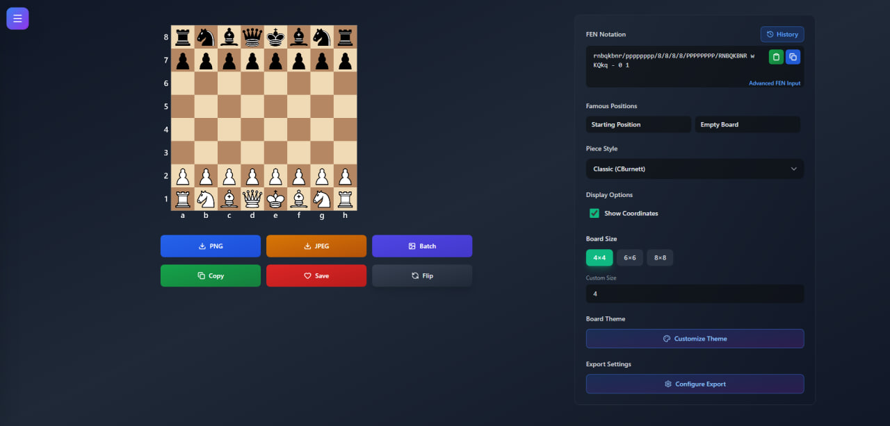

<h1 align="center">♟️ Chess Diagram Generator</h1>

<div align="center">

**Professional chess position visualizer with ultra-HD export capabilities**

[-61DAFB?style=flat-square&logo=react&logoColor=white>)](https://react.dev)
[](https://tailwindcss.com)
[](#)
[](#)
[](https://opensource.org/licenses/MIT)
[](http://makeapullrequest.com)

[Live Demo](https://chess-viewer-site.vercel.app) ·
[Report Bug](https://github.com/BilgeGates/chess_viewer/issues) ·
[Request Feature](https://github.com/BilgeGates/chess_viewer/issues)

</div>

---

## 📖 Table of Contents

- [📖 Table of Contents](#-table-of-contents)
- [🌟 Overview](#-overview)
- [✨ Features](#-features)
- [🖼 Demo \& Screenshots](#-demo--screenshots)
- [🚀 Quick Start](#-quick-start)
  - [Prerequisites](#prerequisites)
  - [Installation](#installation)
  - [Production Build](#production-build)
- [📁 Project Structure](#-project-structure)
  - [Key Architecture Principles](#key-architecture-principles)
- [🛠️ Technology Stack](#️-technology-stack)
  - [Core Technologies](#core-technologies)
  - [Performance Stack](#performance-stack)
- [🌐 Browser Support](#-browser-support)
  - [Required Browser Features](#required-browser-features)
- [🔐 Security \& Privacy](#-security--privacy)
  - [🔒 Security Highlights](#-security-highlights)
  - [🧠 Threat Model](#-threat-model)
  - [🛡️ Data Safety Guarantee](#️-data-safety-guarantee)
- [🤝 Contributing](#-contributing)
  - [Quick Contribution Guide](#quick-contribution-guide)
  - [Contributors](#contributors)
- [📝 License](#-license)
- [👨‍💻 Author](#-author)
  - [Khatai Huseynzada](#khatai-huseynzada)
- [🙏 Acknowledgments](#-acknowledgments)
  - [Special Thanks](#special-thanks)
- [📧 Support \& Contact](#-support--contact)
- [FAQ](#faq)

---

## 🌟 Overview

Chess Diagram Generator is a modern web application for creating **high-quality chess diagrams** from FEN notation.  
It is built for chess players, coaches, authors, streamers, and developers who need **fast, precise, and customizable** board visuals.

---

## ✨ Features

- Full FEN notation support with validation
- Multi-FEN input (up to 10 positions)
- Ultra-HD PNG & JPEG export (up to 12,800×12,800px)
- Batch export & clipboard copy
- 23 professional piece sets
- Advanced color picker & themes
- Favorites, history & famous positions
- Board flip & coordinates

---

## 🖼 Demo & Screenshots

> **Live demo:** https://chess-viewer-site.vercel.app



---

## 🚀 Quick Start

### Prerequisites

```bash
Node.js >= 16
npm >= 8
```

### Installation

```bash
# Clone the repository
git clone https://github.com/BilgeGates/chess_viewer.git

# Navigate to project directory
cd chess_viewer

# Install dependencies
npm install
# or
yarn install

# Start development server
npm start
# or
yarn start
```

The application will automatically open at [http://localhost:3000](http://localhost:3000)

### Production Build

```bash
# Create optimized production build
npm run build

# Preview production build locally
npm run preview

# Deploy to Vercel (requires Vercel CLI)
vercel --prod
```

---

## 📁 Project Structure

<details>
<summary><b>Complete File Tree (Click to expand)</b></summary>

```
chess_viewer/
│
├── 📂 public/
│   ├── index.html
│   ├── manifest.json
│   ├── robots.txt
│   └── sitemap.xml
│
├── 📂 src/
│   │
│   ├── 📂 components/
│   │   │
│   │   ├── 📂 board/              # Chess Board Rendering
│   │   │   ├── BoardSquare.jsx
│   │   │   ├── BoardGrid.jsx
│   │   │   ├── ChessBoard.jsx
│   │   │   ├── MiniChessPreview.jsx
│   │   │   └── index.js
│   │   │
│   │   ├── 📂 features/           # Feature Modules
│   │   │   ├── (export, theme, fen, color-picker modules)
│   │   │   └── index.js
│   │   │
│   │   ├── 📂 interactions/       # Interactive Components
│   │   │   └── index.js
│   │   │
│   │   ├── 📂 layout/             # Layout Components
│   │   │   ├── Navbar.jsx
│   │   │   ├── Footer.jsx
│   │   │   └── index.js
│   │   │
│   │   ├── 📂 ui/                 # Reusable UI Components
│   │   │   ├── Button.jsx
│   │   │   ├── Modal.jsx
│   │   │   ├── Input.jsx
│   │   │   └── index.js
│   │   │
│   │   └── index.js
│   │
│   ├── 📂 pages/                  # Application Pages
│   │   ├── HomePage.jsx
│   │   ├── AboutPage.jsx
│   │   ├── AdvancedFENInputPage.jsx
│   │   ├── DownloadPage.jsx
│   │   ├── FENHistoryPage.jsx
│   │   ├── NotFoundPage.jsx
│   │   ├── SupportPage.jsx
│   │   ├── ThemeCustomizerPage.jsx
│   │   └── index.js
│   │
│   ├── 📂 hooks/                  # Custom React Hooks
│   │   ├── useChessBoard.js
│   │   ├── usePieceImages.js
│   │   ├── useFENHistory.js
│   │   ├── useTheme.js
│   │   ├── useNotifications.js
│   │   ├── useLocalStorage.js
│   │   ├── useColorState.js
│   │   ├── useColorConversion.js
│   │   ├── useCanvasPicker.js
│   │   ├── useInteractiveBoard.js
│   │   ├── useIntersectionObserver.js
│   │   ├── useOutsideClick.js
│   │   ├── usePerformance.js
│   │   ├── useScrollLock.js
│   │   └── index.js
│   │
│   ├── 📂 utils/                  # Utility Functions
│   │   ├── fenParser.js
│   │   ├── colorUtils.js
│   │   ├── coordinateCalculations.js
│   │   ├── canvasExporter.js
│   │   ├── advancedExport.js
│   │   ├── imageOptimizer.js
│   │   ├── pieceImageCache.js
│   │   ├── validation.js
│   │   ├── errorHandler.js
│   │   ├── eventUtils.js
│   │   ├── logger.js
│   │   ├── performance.js
│   │   ├── classNames.js
│   │   └── index.js
│   │
│   ├── 📂 contexts/               # React Contexts
│   │   ├── ThemeSettingsContext.jsx
│   │   └── index.js
│   │
│   ├── 📂 constants/              # Application Constants
│   │   └── chessConstants.js
│   │
│   ├── 📂 routes/                 # Routing Configuration
│   │   └── Router.jsx
│   │
│   ├── App.jsx                    # Root component
│   ├── index.js                   # Entry point
│   └── index.css                  # Global styles
│
├── 📂 docs/                       # Documentation
│   ├── ACCESSIBILITY.md
│   ├── ARCHITECTURE.md
│   ├── CHANGELOG.md
│   ├── DECISIONS.md
│   ├── DESIGN_ERRORS_ANALYSIS.md
│   ├── EXPORT_PIPELINE.md
│   ├── FAQ.md
│   ├── FEN.md
│   ├── KNOWN_ISSUES.md
│   ├── LINTING_SETUP.md
│   ├── PERFORMANCE.md
│   ├── README.md
│   ├── ROADMAP.md
│   └── STATE_MANAGEMENT.md
│
├── 📂 build/                      # Production build output
├── 📂 scripts/                    # Build & utility scripts
│   └── fix-imports.js
│
├── 📄 package.json
├── 📄 craco.config.js
├── 📄 jsconfig.json
├── 📄 tailwind.config.js
├── 📄 postcss.config.js
├── 📄 vercel.json
├── 📄 README.md
├── 📄 LICENSE
├── 📄 CONTRIBUTING.md
├── 📄 CODE_OF_CONDUCT.md
└── 📄 SECURITY.md
```

</details>

### Key Architecture Principles

- **Feature-Based Structure**: Components organized by domain (export, theme, fen, color-picker)
- **Page-Based Routing**: Dedicated pages for different app views
- **Barrel Exports**: Clean imports via `index.js` files in each directory
- **Hooks & Utils at Root**: Globally accessible from `src/hooks` and `src/utils`
- **Comprehensive Documentation**: Detailed guides in `docs/` folder

## 🛠️ Technology Stack

### Core Technologies

<table>
<tr>
<td align="center" width="20%">
  <br>
  <b>React (18+ compatible, built with 19.x)</b><br>
  <sub>UI Framework</sub>
</td>

<td align="center" width="20%">
  <br>
  <b>JavaScript ES6+</b><br>
  <sub>Language</sub>
</td>

<td align="center" width="20%">
  <br>
  <b>Tailwind CSS 3.3.5</b><br>
  <sub>Styling</sub>
</td>

<td align="center" width="20%">
  <br>
  <b>HTML5 Canvas</b><br>
  <sub>Rendering</sub>
</td>

<td align="center" width="20%">
  <br>
  <b>Node.js 16+</b><br>
  <sub>Runtime</sub>
</td>
</tr>
</table>

### Performance Stack

- **Rendering**: HTML5 Canvas
- **Optimization**: React.memo, useCallback, useMemo
- **Storage**: localStorage (browser native)
- **Deployment**: Vercel (Edge + CDN)

---

## 🌐 Browser Support

<div align="center">

| Browser | Version | Status              |
| ------- | ------- | ------------------- |
| Chrome  | 90+     | ✅ Tested           |
| Firefox | 88+     | ✅ Tested           |
| Safari  | 14+     | ✅ Expected to work |
| Edge    | 90+     | ✅ Expected to work |
| Opera   | 76+     | ✅ Expected to work |

</div>

### Required Browser Features

- HTML5 Canvas API
- ES6+ JavaScript
- CSS Grid & Flexbox
- Clipboard API (optional)
- localStorage API

---

## 🔐 Security & Privacy

This project follows a **privacy-first, zero-backend architecture**.  
All functionality runs entirely in the user's browser with no external data flow.

### 🔒 Security Highlights

- ✅ No server-side data storage
- ✅ Client-side processing only
- ✅ No cookies, trackers, or fingerprinting
- ✅ No third-party analytics or telemetry
- ✅ No user data is collected, stored, or transmitted

### 🧠 Threat Model

- No authentication or user accounts
- No sensitive or personal data processed
- No external APIs or background requests
- Attack surface limited to static client-side execution only

### 🛡️ Data Safety Guarantee

> Chess Diagram Generator will **never** upload, sync, or share your data.  
> All positions, exports, favorites, and settings remain local to your device.

---

## 🤝 Contributing

We welcome contributions! Please see [CONTRIBUTING.md](CONTRIBUTING.md) for detailed guidelines.

### Quick Contribution Guide

```bash
# 1. Fork the repository
# 2. Create your feature branch
git checkout -b feature/amazing-feature

# 3. Commit your changes
git commit -m 'Add amazing feature'

# 4. Push to the branch
git push origin feature/amazing-feature

# 5. Open a Pull Request
```

### Contributors

<a href="https://github.com/BilgeGates/chess_viewer/graphs/contributors">
  
</a>

---

## 📝 License

This project is licensed under the **MIT License** - see the [LICENSE](LICENSE) file for details.

```
MIT License

Copyright (c) 2026 Khatai Huseynzada

Permission is hereby granted, free of charge, to any person obtaining a copy
of this software and associated documentation files (the "Software"), to deal
in the Software without restriction, including without limitation the rights
to use, copy, modify, merge, publish, distribute, sublicense, and/or sell
copies of the Software, and to permit persons to whom the Software is
furnished to do so, subject to the following conditions:

The above copyright notice and this permission notice shall be included in all
copies or substantial portions of the Software.

THE SOFTWARE IS PROVIDED "AS IS", WITHOUT WARRANTY OF ANY KIND, EXPRESS OR
IMPLIED, INCLUDING BUT NOT LIMITED TO THE WARRANTIES OF MERCHANTABILITY,
FITNESS FOR A PARTICULAR PURPOSE AND NONINFRINGEMENT. IN NO EVENT SHALL THE
AUTHORS OR COPYRIGHT HOLDERS BE LIABLE FOR ANY CLAIM, DAMAGES OR OTHER
LIABILITY, WHETHER IN AN ACTION OF CONTRACT, TORT OR OTHERWISE, ARISING FROM,
OUT OF OR IN CONNECTION WITH THE SOFTWARE OR THE USE OR OTHER DEALINGS IN THE
SOFTWARE.
```

---

## 👨‍💻 Author

<div align="center">

### Khatai Huseynzada

**Front-End Web Developer | Open Source Contributor**

[](https://github.com/BilgeGates)
[](https://linkedin.com/in/khatai-huseynzada)
[](mailto:darkdeveloperassistant@gmail.com)

</div>

---

## 🙏 Acknowledgments

This project wouldn't be possible without these amazing resources:

<table>
<tr>
<td align="center" width="25%">
<br>
<b>Lichess</b><br>
<sub>Lichess piece SVGs</sub>
</td>
  
<td align="center" width="25%">
<br>
<b>React Team</b><br>
<sub>Amazing framework</sub>
</td>
  
<td align="center" width="25%">
  <br>
  <b>Tailwind Labs</b><br>
  <sub>Beautiful utilities</sub>
</td>

<td align="center" width="25%">
  <br>
  <b>Lucide Icons</b><br>
  <sub>Icon library</sub>
</td>

</tr>
</table>

### Special Thanks

- **Lichess.org** - Inspiration and FEN notation standards
- **Vercel** - Hosting and deployment platform

---

## 📧 Support & Contact

<div align="center">

| Channel                 | Link                                                                         |
| ----------------------- | ---------------------------------------------------------------------------- |
| 🐛 **Bug Reports**      | [GitHub Issues](https://github.com/BilgeGates/chess_viewer/issues)           |
| 💡 **Feature Requests** | [GitHub Discussions](https://github.com/BilgeGates/chess_viewer/discussions) |
| 📧 **Email**            | darkdeveloperassistant@gmail.com                                             |

_Responses on a best-effort basis_

</div>

---

## FAQ

<details>
<summary><b>How do I report a bug?</b></summary>

1. Check if the issue already exists in [GitHub Issues](https://github.com/BilgeGates/chess_viewer/issues)
2. If not, create a new issue with:
   - Clear description of the problem
   - Steps to reproduce
   - Expected vs actual behavior
   - Screenshots (if applicable)
   - Browser and OS information
   </details>

<details>
<summary><b>Can I use this commercially?</b></summary>

Yes! This project is MIT licensed, which means you can use it for commercial purposes.  
Just include the license notice in your project.

</details>

<details>
<summary><b>How do I add a new piece set?</b></summary>

1. Add piece images to `/public/pieces/[set-name]/`
2. Update `PIECE_SETS` in `src/constants/chessConstants.js`
3. Submit a pull request with your changes
</details>

<details>
<summary><b>Can I export to SVG format?</b></summary>

Currently only PNG and JPEG are supported.  
SVG export is planned for version **4.0.0**.  
You can track progress in [Issue #1](https://github.com/BilgeGates/chess_viewer/issues/1).

</details>

---

**© 2026 Khatai Huseynzada. Licensed under MIT.**
